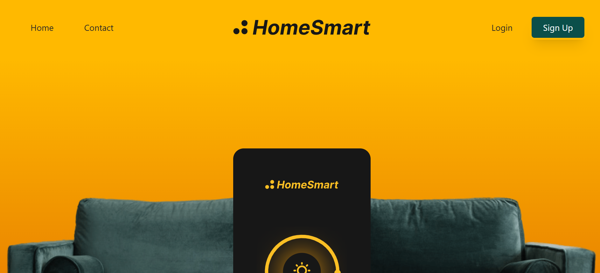
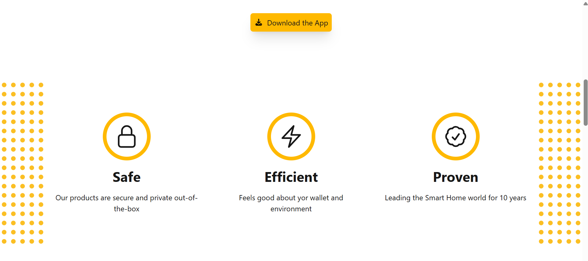
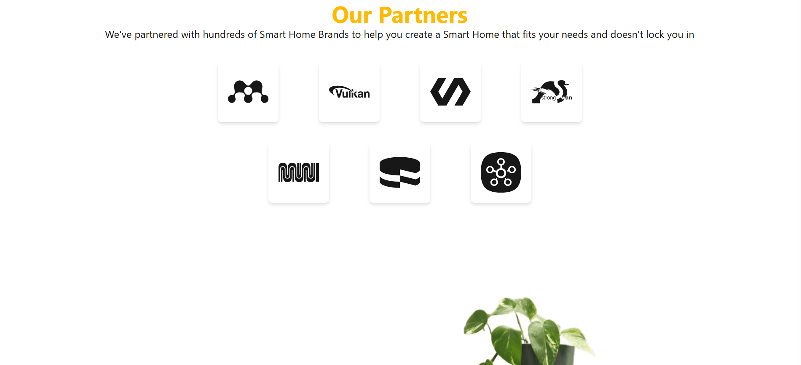

# Home-smart-landing-page
A modern and responsive Smart Home landing page built using HTML and Tailwind CSS. This project showcases a clean UI, responsive layout, and modern design techniques suitable for promoting a smart home application or product.
HomeSmart Landing Page

🚀 Features
📱 Responsive Design – Works smoothly across mobile, tablet, and desktop devices.
🎨 Modern UI – Built with Tailwind CSS utility classes for a clean and minimal design.
🌙 Dark Mode Support – Includes dark theme styling.
📦 Reusable Components – Structured sections such as navigation, hero, features, partners, CTA, and contact form.
⚡ Optimized Layout – Uses Flexbox and Grid for efficient and scalable layout structure.
🧭 Accessible Navigation – Includes focus states and accessible menu interactions.

🖥️ Sections Included
Navigation Bar with responsive mobile menu
Hero Section with product/app preview
Features Section (Safe, Efficient, Proven)
Partners Section showing supported brands
Call-to-Action Section
Contact Form
🛠️ Technologies Used
HTML5
Tailwind CSS
JavaScript
Responsive Design (Flexbox & Grid)
📂 Project Structure
project-folder
|──dist
|──node-modules
|──screenshots
  |──main-section
  |──features-section
  |──partners-section
  |──contact-section
|──src
  ├──── index.html
  ├── app.js
  ├── output.css
  │──input.css
  ├── assets
  │   ├── logo.svg
  │   ├── couch.png
  │   ├── app.svg
  │   ├── lamp.png
  │   ├── table.png
  │   └── partner images
|── package
|── package-lock

📸 Preview

A modern landing page designed for a Smart Home platform, allowing users to explore features, partners, and download the application.

  
  
  
  !contact section](screenshots/contact-section.png)
💡 Purpose

This project was built to practice and demonstrate:

Tailwind CSS layout techniques
Responsive web design
UI component structuring
Accessibility best practices
